<h2 align="center"> Проект по автоматизации тестирования сервиса "Allure TestOps"</h2>
<p  align="center">
<a href="https://qameta.io/"></a>
</p>

# <a name="Содержание">Содержание</a>
+ [Описание](#Описание)
+ [Технологии и инструменты](#Технологии-и-инструменты)
+ [Варианты запуска](#Варианты-запуска)
    + [Команды для gradle](#команды-для-gradle)
    + [Запуск в Jenkins](#запуск-в-jenkins)
+ [Telegram уведомления](#Telegram-уведомления)
+ [Результаты тестов в Allure Report](#Результаты-тестов-в-Allure-Report)
+ [Интеграция с Allure TestOps](#Интеграция-с-Allure-TestOps)
+ [Интеграция с Jira](#Интеграция-с-Jira)
+ [Видео запуска тестов](#Видео-запуска-тестов)


# <a name="Описание">Описание</a>
Тестовый проект состоит из веб-тестов (UI), тестов API + UI.\
Краткий список интересных фактов о проекте:
- [x] `Page Object` проектирование
- [x] Параметризованные тесты
- [x] Различные файлы конфигурации для запуска теста в зависимости от параметров сборки
- [x] Конфигурация с библиотекой `Owner`
- [x] Использование `Lombok` для моделей в API тестах
- [x] Использование request/response спецификаций для API тестов
- [x] Custom Allure listener для API requests/responses логов
- [x] Интеграция с `Allure TestOps`
- [x] Автотесты как тестовая документация
- [x] Интеграция с `Jira`


# <a name="Технологии и инструменты">Технологии и инструменты</a>
<p  align="center">
  <code></code>
  <code></code>
  <code></code>
  <code></code>
  <code></code>
  <code></code>
  <code></code>
  <code></code>
  <code></code>
  <code></code>
  <code></code>
  <code></code>
  <code></code>
 </p>

Автотесты в этом проекте написаны на `Java` использую `Selenide` фреймворк.\
`Gradle` - используется как инструмент автоматизации сборки.  \
`JUnit5` - для выполнения тестов.\
`REST Assured` - для тестирования REST-API сервисов.\
`Jenkins` - CI/CD для запуска тестов удаленно.\
`Selenoid` - для удаленного запуска браузера в `Docker` контейнерах.\
`Allure Report` - для визуализации результатов тестирования.\
`Telegram Bot` - для уведомлений о результатах тестирования.\
`Allure TestOps` - как система управления тестированием.

[Вернуться к оглавлению ⬆](#Содержание)

<a name="ImplementedСhecks"><h2>:heavy_check_mark:  Реализованные проверки:</h2></a>
<a id="cases-ui"></a>UI-кейсы:

:heavy_check_mark: Авторизация на сайте</br>

:heavy_check_mark: Создание проекта</br>

:heavy_check_mark: Удаление проекта</br>

:heavy_check_mark: Создание test case</br>

:heavy_check_mark: Редактирование имяни test case</br>

:heavy_check_mark: Добовление шагов в test case</br>

:heavy_check_mark: Добовление tag в  test case</br>

:heavy_check_mark: Добовление описания в test case</br>

:heavy_check_mark: Добовление attachment в test case</br>

<a id="cases-api"></a>API-кейсы:

:heavy_check_mark: Авторизация пользователя</br>

:heavy_check_mark: Создание test case</br>

:heavy_check_mark: Редактирование имяни test case</br>

:heavy_check_mark: Добовление шагов в test case</br>

:heavy_check_mark: Добовление tag в  test case</br>

:heavy_check_mark: Добовление описания в test case</br>

:heavy_check_mark: Удаление test case</br>

<a id="cases-mobile"></a>Mobile-кейсы:

# <a name="Варианты запуска">Варианты запуска</a>

## <a name="GradleCommand">Команды для Gradle</a>
Для запуска локально и в Jenkins используется следующая команда::
```bash
gradle clean <tag>  -Dplatform=<platform>
```
Дополнительные параметры:
> `-DbrowserWithVersion` - для передачи браузера и версии        
> `-DbrowserSize` - для передачи разрешения     
> `-DapiBaseUrl=url` можно добавить для установки базового URL-адреса для тестов API.

`tag` - теги для запуска выполнения тестов:
>- *api*
>- *web*
>- *regress*
 
`platform` - определяет среду для запуска этих тестов:
>- *local* - для запуска тестов локально
>- *remote* - для запуска тестов удаленно на selenoid

Дополнительные свойства извлекаются из соответствующего файла конфигурации (в зависимости от значения `platform`):
```bash
./resources/config/${platform}.properties
```

Допустимые комбинации:
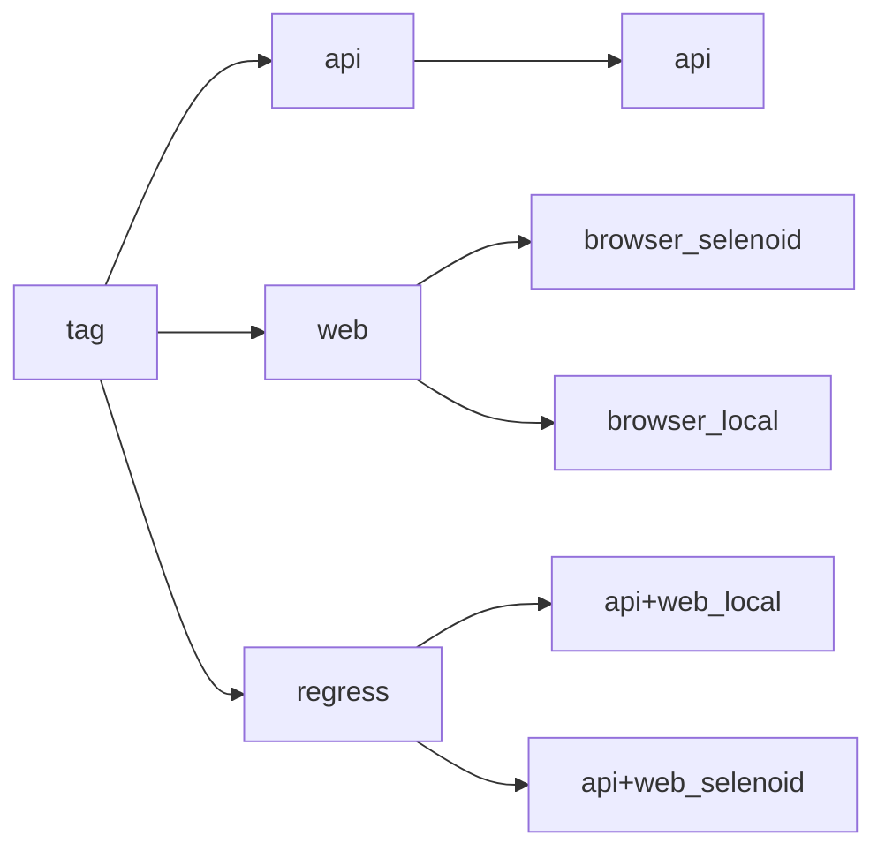

[Вернуться к оглавлению ⬆](#Содержание)

## <a name="Запуск в Jenkins">Запуск в [Jenkins](https://jenkins.autotests.cloud/job/allure_api_ui/)</a>
Главная страница сборки:
<p  align="center">
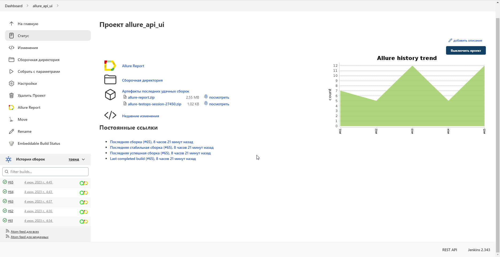
</p>

Параметризованное задание Jenkins может быть запущено с необходимыми ***tag*** и ***platform***:
<p  align="center">
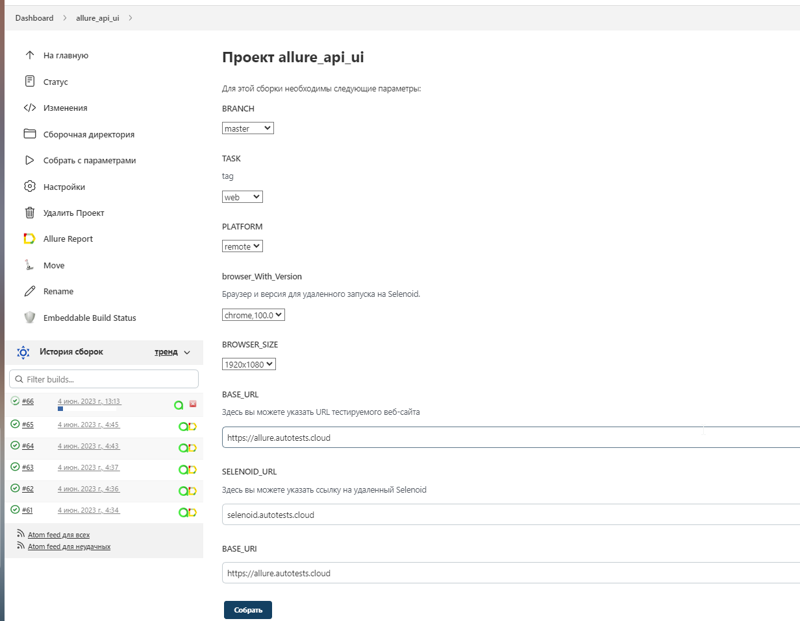
</p>

Конфиденциальная информация (имена для входа и пароли) хранится в зашифрованном виде в хранилище учетных данных Jenkins.\
И относительно безопасно передается в сборку аргументами gradle, а его значения маскируются в логах.

После завершения сборки результаты тестирования доступны в:
>- <code><strong>*Allure Report*</strong></code>
>- <code><strong>*Allure TestOps*</strong></code> - результаты загружаются туда и тест-кейсы могут автоматически обновляться в соответствии с последними изменениями в коде.

[Вернуться к оглавлению ⬆](#Содержание)

# <a>Telegram уведомления</a>
Telegram-бот отправляет краткий отчет в указанный телеграм-чат по результатам каждой сборки.
<p  align="center">
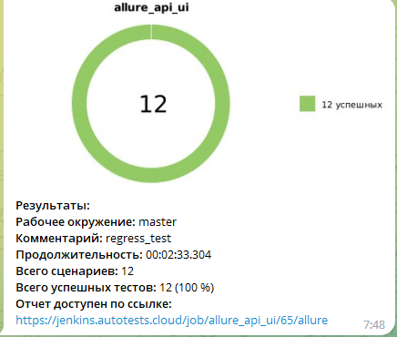
</p>

[Вернуться к оглавлению ⬆](#Содержание)

# <a name="AllureReport">Результаты тестов в [Allure Report](https://jenkins.autotests.cloud/job/dostavka.magnit.ru/19/allure/)</a>

## Главная страница
Главная страница отчета Allure содержит следующие блоки:

>- <code><strong>*ALLURE REPORT*</strong></code> - отображает дату и время теста, общее количество запущенных тестов, а также диаграмму с процентом и количеством успешных, упавших и сломавшихся в процессе выполнения тестов
>- <code><strong>*TREND*</strong></code> - отображает тенденцию выполнения тестов для всех запусков
>- <code><strong>*SUITES*</strong></code> - отображает распределение тестов по сьютам
>- <code><strong>*CATEGORIES*</strong></code> - отображает распределение неудачных тестов по типам дефектов
<p align="center">
  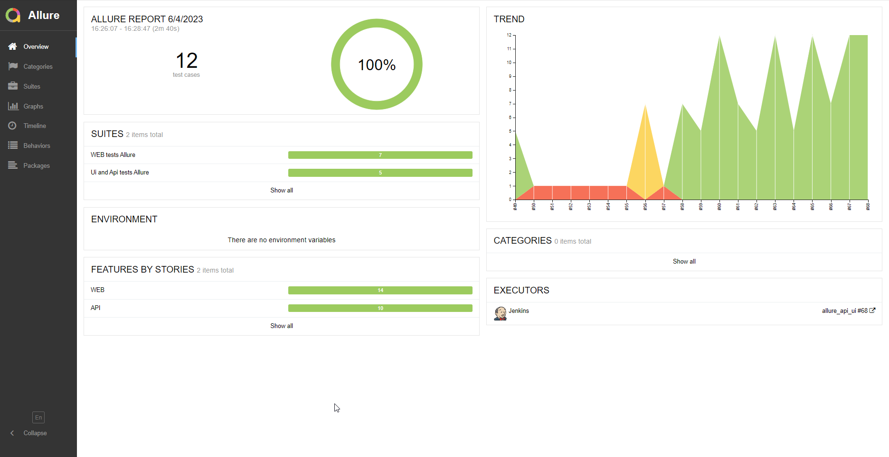
</p>

## Список тестов с шагами и тестовыми артефактами
На странице список тестов, сгруппированных по наборам, с указанием статуса для каждого теста.\
Может быть показана полная информация о каждом тесте: теги, продолжительность, подробные шаги.

<p align="center">
  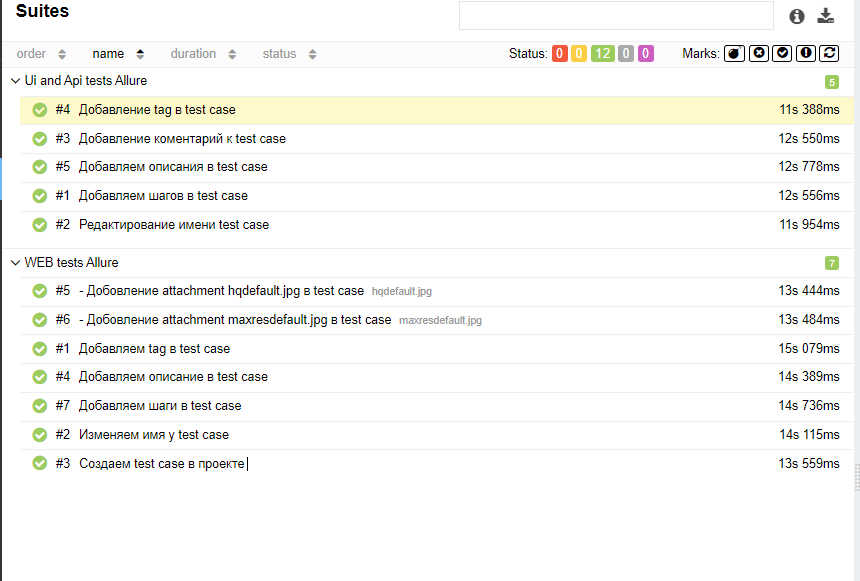
</p>

Также доступны дополнительные тестовые артефакты:
>- Screenshot
>- Page Source
>- Video
>- Browserstack full info link

<p align="left">
  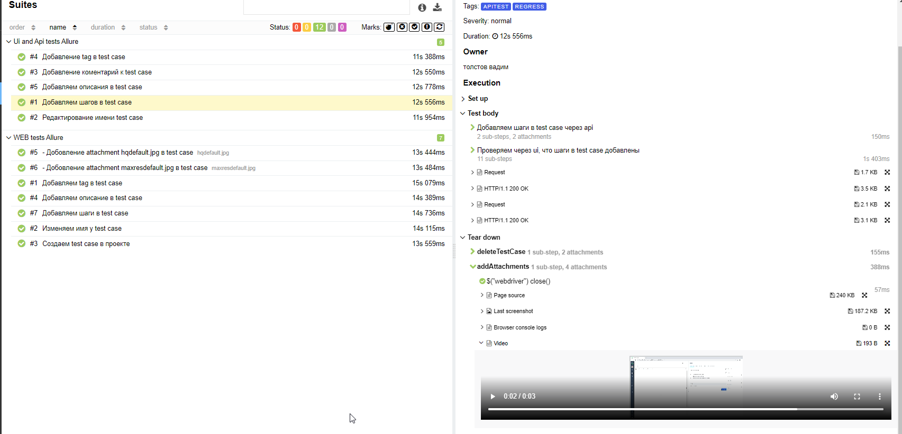
</p>

[Вернуться к оглавлению ⬆](#Содержание)

# <a>Интеграция с [Allure TestOps](https://allure.autotests.cloud/project/2993/dashboards)</a>
> Ссылка доступна только авторизованным пользователям.

Тест-кейсы в проекте импортируются и постоянно обновляются из кода,
поэтому нет необходимости в синхронизации ручных тест-кейсов и автотестов.\
Достаточно создать и обновить автотест в коде и тест-кейс всегда будет в актуальном состоянии.

## Allure TestOps Dashboard

<p align="center">
  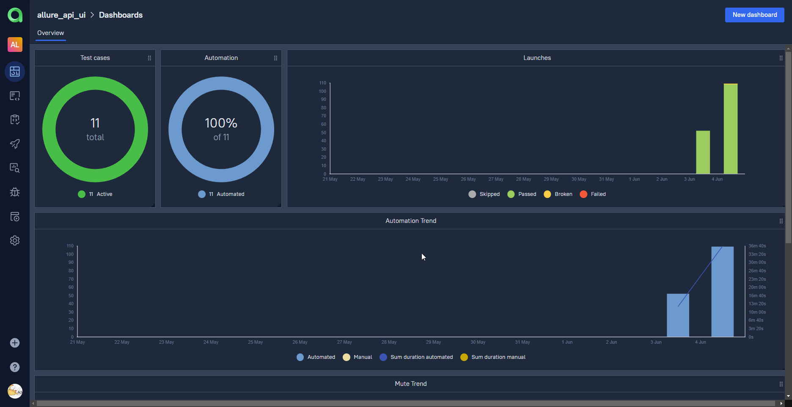
</p>

<p align="center">
  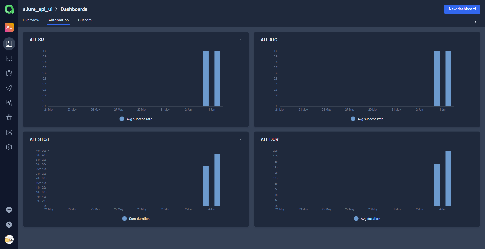
</p>

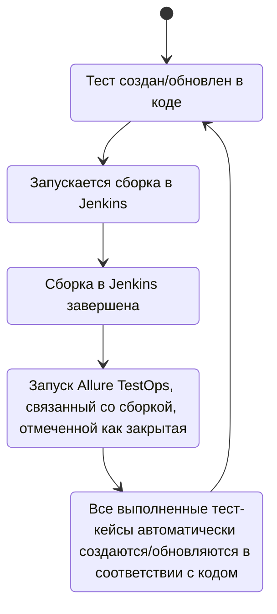

## Allure TestOps Test Cases

<p align="center">
  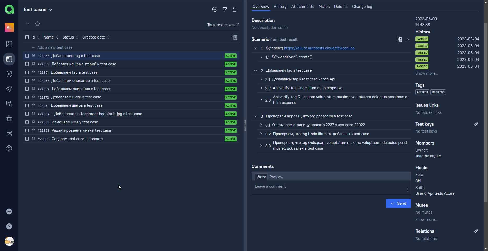
</p>

[Вернуться к оглавлению ⬆](#Содержание)

# <a>Интеграция с Jira</a>
<p align="center">
  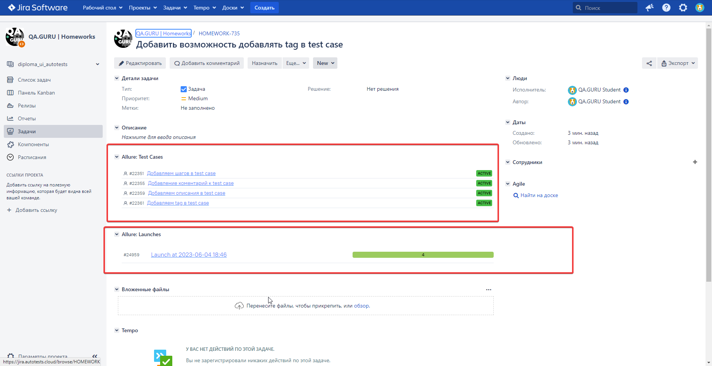
</p>

[Вернуться к оглавлению ⬆](#Содержание)

# <a>Видео запуска тестов</a>

<p align="center">
  
</p>

[Вернуться к оглавлению ⬆](#Содержание)
